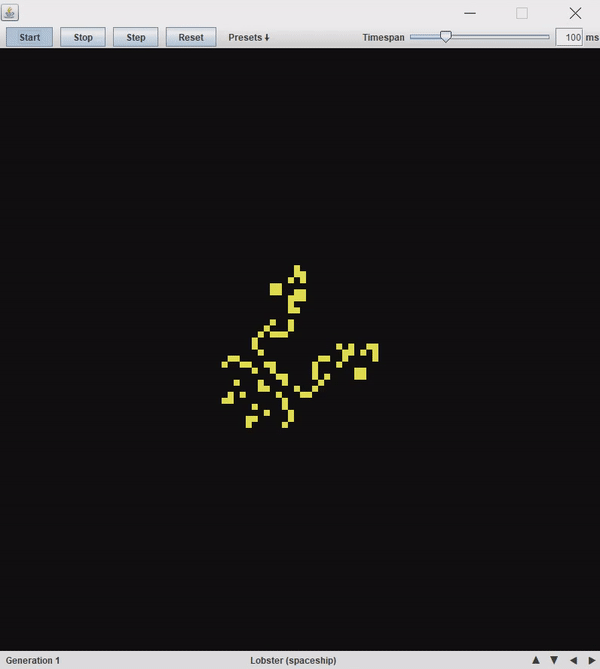

# Gol-Java

A simple Java implementation of John Conway's Game of Life. It can load and execute .rle patterns and the timespan 
between generations can be adjusted. 

I included a few sample patters and more can be found 
[here](http://www.conwaylife.com/patterns/all.zip). However, if the pattern does not fit the default grid size it will not load on startup. The set also includes patterns with rules other than B3/S23 which are not supported as of now.

